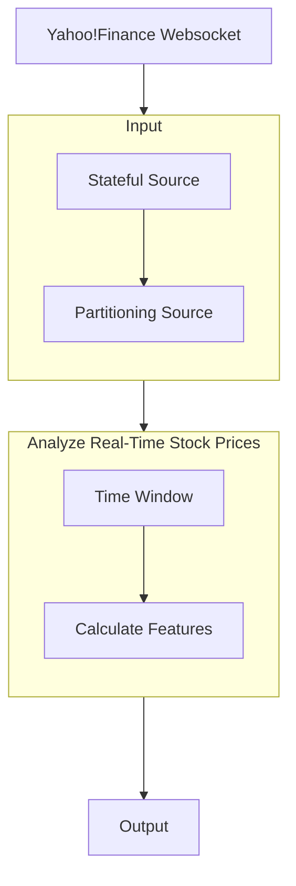

# Stream Real-Time Stock Prices and Analyze Them with Numpy

In this post, you'll learn how to stream real-time stock prices from Yahoo! Finance using Websockets and analyze them using Numpy. By creating a Bytewax dataflow, you'll be able to transform and react to market data in real-time, making it ideal for live data analysis.

WebSockets are a powerful tool that allows you to quickly access up-to-date information from websites. With Numpy, you can efficiently analyze this data and create features that can be used in machine learning models or automated trading bots.

Follow our blog and learn how to extract valuable insights from real-time market data today with Python!


## Table of contents

* [Diving Into the World of WebSockets!](#diving-into-the-world-of-websockets)
* [Understanding Protobufs](#understanding-protobufs)
* [Dataflow: overview](#dataflow-overview)
* [Dataflow: Input](#dataflow-input)
* [Dataflow: Analyzing Real-Time Stock Prices](#dataflow-analyzing-real-time-stock-prices)
* [Dataflow: Output](#dataflow-output)
* [Execution](#execution)
* [Summary](#summary)


## Diving Into the World of websockets!

Have you ever noticed how stock prices on Yahoo! Finance update in real-time? It's all thanks to WebSockets, which happen to be a great source of data for Bytewax dataflows.

In general, if you come across a publicly available website that displays something in real-time, chances are it's powered by WebSockets. We can figure this out with some quick inspection using Chrome or Mozilla developer tools.


While inspecting the site, we'll see the WebSocket and the data being returned. It might be a little hard to decipher, but fear not! Others have done detective work for us and have already determined that it's base64 encoded and is in the protobuf format. We'll start then by writing a little function that deserializes Protobuf data so that it can be ingested into the Bytewax dataflow in a second step.


## Understanding Protobufs

Protobufs are Google's answer to platform-agnostic data serialization. They provide a standardized way to serialize structured data in a compact binary format. If you're new to Protobufs, you can check out their documentation [here](https://protobuf.dev/getting-started/pythontutorial/).

In our case, we're using Protobufs to serialize and deserialize our streaming stock data. To get started writing protocol buffers, you will usually need to install the protobuf tools and define a protobuf schema.

You can skip this because ours is already defined in [ticker.proto](https://github.com/bytewax/streaming-numpy-finance/blob/main/ticker.proto). The way Protobufs work, the schema is compiled by the protoc command line tool and a Python serialization file is generated. Here, we have [this file ready](https://github.com/bytewax/streaming-numpy-finance/blob/main/ticker_pb2.py) and we just take care of the deserialization step, as shown below:

```python
import base64
from ticker_pb2 import Ticker

# Function deserializing Protobuf messages
def deserialize(message):
    '''Use the imported Ticker class to deserialize 
    the protobuf message

    returns: ticker id and ticker object
    '''
    ticker_ = Ticker()
    message_bytes = base64.b64decode(message)
    ticker_.ParseFromString(message_bytes)
    return ticker_.id, ticker_
```
    
At this point we have defined a function that takes WebSocket messages as input, decodes and deserializes them and then returns a tuple of the format (ticker_.id, ticker_). We have done this so that we can aggregate data by the ticker symbol downstream.

Now that we know the WebSocket URL and have our Protobufs function, we can build a Bytewax dataflow to get live stock data as input and analyze it to make informed trading decisions.


## Dataflow: overview




## Dataflow: input

**Connect to Yahoo!Finance**

A side note on data inputs: since we're working with live data, any dataflow crash may result in data loss. To avoid this, it's recommended to use reliable data sources like Redpanda or Kafka. However, for the purpose of this demo, we'll proceed without worrying about failure.

Our goal is to build a scalable system that can monitor multiple tickers across different workers in real time. By crafting an asynchronous function to connect to the Yahoo! Finance WebSocket, we facilitate streaming of stock price data into our dataflow. This process involves the `websockets` Python library for WebSocket connections and `bytewax` for dataflow integration.

The function `_ws_agen` inputs tickers identifiers (e.g. `["AMZN", "MSFT"]`), establishing a connection to Yahoo!Finance WebSocket. It subscribes to them for live stock price updates, sending a JSON subscription message, awaiting a confirmation response with `ws.recv()`, deserializing it with the previously defined function `deserialize` and yield it.


```python
import json
import websockets

# Function yielding deserialized data from Yahoo!Finance
async def _ws_agen(worker_tickers):
    url = "wss://streamer.finance.yahoo.com/"
    # Establish connection to Yahoo Finance with WebSockets
    async with websockets.connect(url) as websocket:
        # Subscribe to tickers
        msg = json.dumps({"subscribe": worker_tickers})
        await websocket.send(msg)
        await websocket.recv()

        while True:
            # Receive updates
            msg = await websocket.recv()
            # Deserialize
            msg_ok = deserialize(msg)
            yield msg_ok
```


**Stateful Source**

To efficiently process and manage this data, we implement the `YahooPartition` class, extending Bytewax's `StatefulSourcePartition`. This enables us to obtain the current stock data at the beginning of the stream when we subscribe.

Within `YahooPartition`, `_ws_agen` is used for data fetching through `self._batcher` - in the code we specify batching incoming data every 0.5 seconds or upon receiving 100 messages, optimizing data processing and state management. This structure ensures an efficient, scalable, and fault-tolerant system for real-time stock price analysis.


```python
from bytewax import operators as op
from bytewax.dataflow import Dataflow
from bytewax.inputs import FixedPartitionedSource, StatefulSourcePartition, batch_async

# Yahoo partition class inherited from Bytewax input StatefulSourcePartition class
class YahooPartition(StatefulSourcePartition):
    '''
    Input partition that maintains state of its position.
    '''
    def __init__(self, worker_tickers):
        '''
        Get deserialized messages from Yahoo Finance and batch them
        up to 0,5 seconds or 100 messages.
        '''
        agen = _ws_agen(worker_tickers)
        self._batcher = batch_async(agen, timedelta(seconds=0.5), 100)

    def next_batch(self):
        '''
        Attempt to get the next batch of items.
        '''
        return next(self._batcher)

    def snapshot(self):
        '''
        Snapshot the position of the next read of this partition.
        Returned via the resume_state parameter of the input builder.
        '''
        return None
```


**Partitioning source data**

Aligned with our goal to build a scalable system that can monitor multiple tickers across different workers in real time, we now create a `YahooSource` class. It serves as a source for partitioning data based on ticker identifiers. It is crucial for organizing and distributing the data flow across multiple workers, facilitating parallel processing of tickers.


```python
# Yahoo source class inherited from Bytewax input FixedPartitionedSource class
class YahooSource(FixedPartitionedSource):
    '''
    Input source with a fixed number of independent partitions.
    '''
    def __init__(self, worker_tickers):
        '''
        Initialize the class with the ticker list
        '''
        self.worker_tickers = worker_tickers

    def list_parts(self):
        '''
        List all partitions the worker has access to.
        '''
        return ["single-part"]

    def build_part(self, step_id, for_key, _resume_state):
        '''
        Build anew or resume an input partition.
        Returns the built partition
        '''
        return YahooPartition(self.worker_tickers)
```


**Constructing the Dataflow**

Alright, almost there! We just need now to construct the dataflow. 

We'll start with creating a Dataflow object named `yahoofinance`. Once this is initialized, we can incorporate an input data source into the data flow. 

We can do this by using the bytewax module operator imported as `op`. We will use `op.input`, specify its input id as `input`, pass the 'yahoofinance' dataflow along with the data source - in this case the source of data is the `YahooSource` class we defined earlier initialized with `ticker_list`.

The resulting initialization and data structure output looks as follows:

```python
# Creating dataflow and input
flow = Dataflow("yahoofinance")
inp = op.input(
    "input", flow, YahooSource(ticker_list)
)
# ('AMZN', id: "AMZN"
# price: 184.585
# time: 1713276945000
# exchange: "NMS"
# quoteType: EQUITY
# marketHours: REGULAR_MARKET
# changePercent: 0.52554822
# dayVolume: 7182358
# dayHigh: 184.59
# dayLow: 182.26
# change: 0.965011597
# lastSize: 100
# priceHint: 2
# )
```


## Dataflow: Analyzing Real-Time Stock Prices

**Time window**

A necessary step when writing an automated trading bot is to create some understanding around what is happening from the market data. This could either be via feature engineering in the case of machine learning or technical analysis for a trend-based algorithm.

Regardless a windowing operator will come in handy to take our data and accumulate it over a window of time so we can pull out some of the information "hidden" in the data. To start, we are going to take our real-time data and get the 1 min average price, the high, low and the start and end price in that interval.

First, we'll accumulate the data in a Numpy array. Numpy is a popular library for data analysis due to its speed and versatility. There are other options with more expressive APIs, but Numpy provides the capabilities we need.

```python
from datetime import datetime, timedelta, timezone
import numpy as np
import bytewax.operators.window as win
from bytewax.operators.window import EventClockConfig, TumblingWindow

def build_array():
    '''
    Build an empty array
    '''
    return np.empty((0,3))

def acc_values(np_array, ticker):
    '''
    Accumulator function; inserts time, price and volume values into the array
    '''
    return np.insert(np_array, 0, np.array((ticker.time, ticker.price, ticker.dayVolume)), 0)

def get_event_time(ticker):
    '''
    Retrieve event's datetime from the input (Must be UTC)
    '''
    return datetime.utcfromtimestamp(ticker.time/1000).replace(tzinfo=timezone.utc)

# Configure the `fold_window` operator to use the event time
clock_config = EventClockConfig(get_event_time, wait_for_system_duration=timedelta(seconds=10))

# Add a 5 seconds tumbling window, that starts at the beginning of the minute
align_to = datetime.now(timezone.utc)
align_to = align_to - timedelta(
    seconds=align_to.second, microseconds=align_to.microsecond
)
window_config = TumblingWindow(length=timedelta(seconds=60), align_to=align_to)
window = win.fold_window("1_min", inp, clock_config, window_config, build_array, acc_values)
```

We have quite a bit going on here, so let's unpack this. First, we have two functions: a builder function (`build_array`) used to build data, and an updater function (`acc_values`) used to accumulate data. These are the last two arguments in the `fold_window` operator. 

Next, we have an `get_event_time` function that will take the time field and parse it to pull out the event time to be used in the window, and then we have the `align_to` time, which will be used as the start of our window. These are both arguments in the `TumblingWindow` module.

The output of this step will be an accumulated array of prices that we have received over the minute.


**Features**

Now we can extract the features from this data that we would then use in a machine learning model or trading algorithm.

```python
def calculate_features(ticker__data):
    '''
    Data analysis function; 
    Returns metadata, time, min, max, first price, last price and volume for each window
    '''
    ticker, data = ticker__data
    win_data = data[1]
    return (
        ticker,
        data[0], # metadata
        {
            "time":win_data[-1][0],
            "min":np.amin(win_data[:,1]), 
            "max":np.amax(win_data[:,1]),
            "first_price":win_data[:,1][-1], 
            "last_price":win_data[:,1][0],
            "volume":win_data[:,2][0] - win_data[:,2][-1]
        }
    )

features = op.map("features", window, calculate_features)
```

The `calculate_features` function uses Numpy's built-in capabilities to efficiently calculate the minimum and maximum prices, first and last price, and volume for each ticker symbol over the given time window.


## Dataflow: output

After analyzing the stock prices, it's time to output the results. In this demo, we'll print them out to the console. In a real trading bot, you might want to use the insights to make trades or store them somewhere for further analysis. To print the results, we'll use `StdOutSink` from Bytewax connectors stdio.

```python
from bytewax.connectors.stdio import StdOutSink

op.output("out", features, StdOutSink())
```


## Execution

Once we have the output set up, we can execute our dataflow running the following bash command in the terminal: 

``` bash
python -m bytewax.run dataflow
```

This will process real-time stock price data for two tickers: AMZN and MSFT and provide useful insights such as minimum price, maximum price, first price, last price and volume for the 1-minute time window.

```bash
('AMZN', WindowMetadata(open_time: 2024-04-16 14:20:00 UTC, close_time: 2024-04-16 14:21:00 UTC), {'time': 1713277219000.0, 'min': 184.3800048828125, 'max': 184.6199951171875, 'first_price': 184.61000061035156, 'last_price': 184.389892578125, 'volume': 56134.0})
('MSFT', WindowMetadata(open_time: 2024-04-16 14:20:00 UTC, close_time: 2024-04-16 14:21:00 UTC), {'time': 1713277219000.0, 'min': 416.8399963378906, 'max': 417.2900085449219, 'first_price': 417.2900085449219, 'last_price': 416.8399963378906, 'volume': 18399.0})
```


## Summary

That's it! You have learned how to leverage Websockets, Numpy and Bytewax for real-time data analysis. We streamed real-time stock prices from Yahoo! Finance and analyzed them in a Bytewax dataflow. We demonstrated how to connect to the Yahoo! Finance WebSocket, deserialize protobuf messages, and calculated features like the 1-minute high, low, and start and end price. 

While this example dataflow simply prints out the results, it could be extended to include trading logic or to write the results to another location for further analysis. 

We hope this guide has shown you how to extract valuable insights from real-time market data and inspired you to explore the capabilities of Python streaming with Bytewax for your own financial analysis and trading projects!